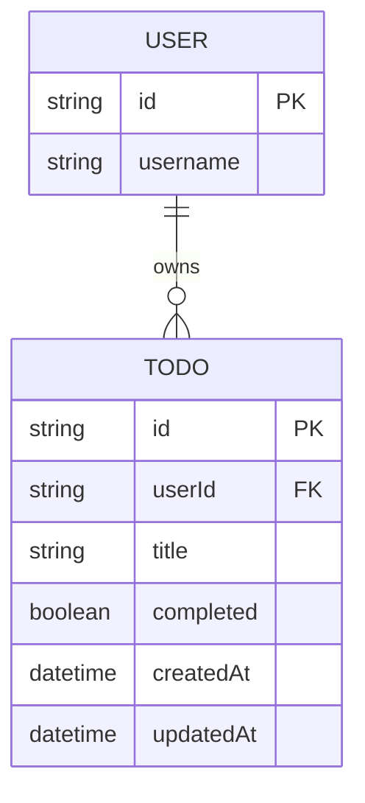

# Domain Model

The domain is small: each signed-in User owns a flat list of Todo entries.

`USER` is the identity Thunder authenticates — the API never stores
credentials, only the `userId` it reads off the signed gateway assertion.
Every `TODO` row is scoped to exactly one `userId`, which is how the API
enforces that a user only ever sees their own todos.