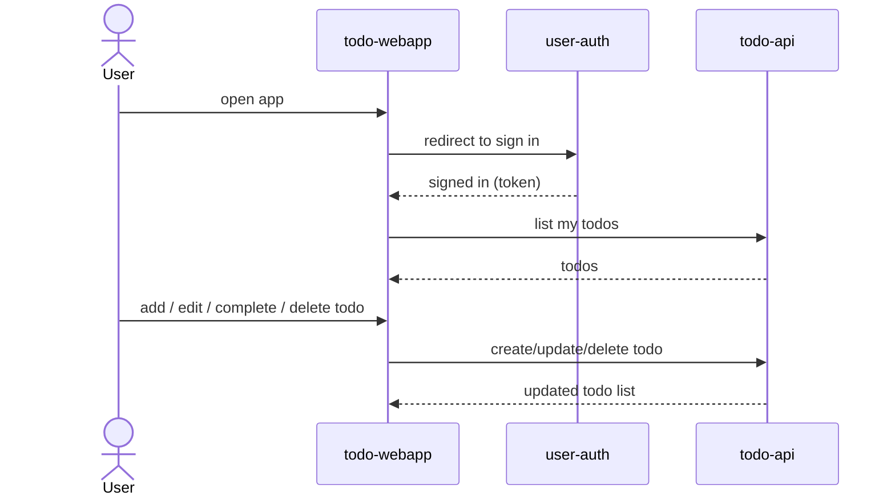

# Sign In and Manage Todos

A User signs in through Thunder and then manages their personal todo list via
the webapp and the API.

```mermaid
sequenceDiagram
    actor User
    participant todo-webapp
    participant user-auth
    participant todo-api

    User->>todo-webapp: open app
    todo-webapp->>user-auth: redirect to sign in
    user-auth-->>todo-webapp: signed in (token)
    todo-webapp->>todo-api: list my todos
    todo-api-->>todo-webapp: todos
    User->>todo-webapp: add / edit / complete / delete todo
    todo-webapp->>todo-api: create/update/delete todo
    todo-api-->>todo-webapp: updated todo list
```

